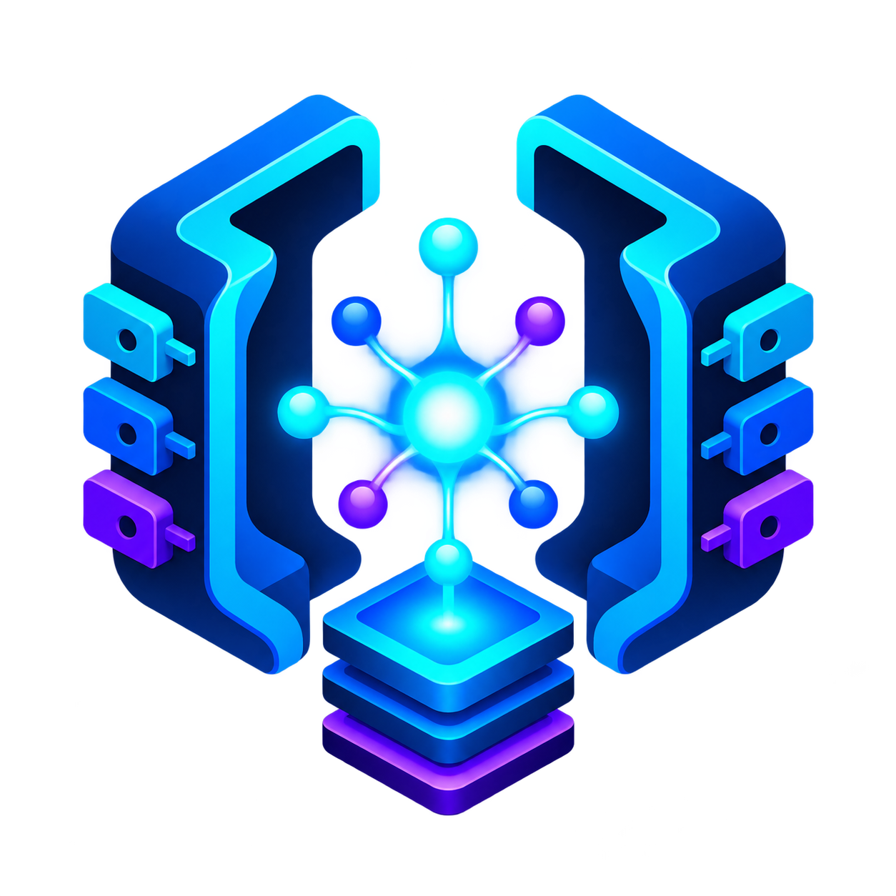
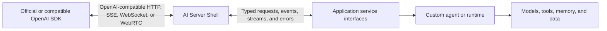

<div align="center">
  

  # AI Server Shell

  **A pluggable Go server shell for building OpenAI-compatible APIs.**

  [](https://go.dev/)
  [](LICENSE)
  [](#project-status)
</div>

AI Server Shell is the server-side counterpart to an OpenAI client SDK. It owns the wire protocol, routes, streaming transports, typed events, validation, lifecycle, and error mapping. Applications provide the behavior by implementing small Go interfaces.

The goal is simple: point an existing OpenAI SDK at a different endpoint and run your own agent, model gateway, memory system, tools, or domain runtime behind it.

> [!IMPORTANT]
> This repository is in its design and M0 phase. No compatibility guarantee is made until the conformance suite is published and passing.

## Why this project exists

The Go ecosystem has excellent OpenAI clients, model gateways, proxies, and inference servers. What is missing is a focused server framework with a gRPC-like integration model:

1. AI Server Shell implements the OpenAI-compatible protocol surface.
2. A developer implements service interfaces.
3. Existing OpenAI clients connect by changing their base URL.

AI Server Shell is not an agent framework and does not require a particular model provider.

## Intended developer experience

The following API is a design target, not yet a released contract:

```go
type TutorRealtime struct{}

func (t *TutorRealtime) Open(
	ctx context.Context,
	req realtime.OpenRequest,
) (realtime.Session, error) {
	return newTutorSession(req), nil
}

shell := aiservershell.New(
	aiservershell.WithRealtime(&TutorRealtime{}),
	aiservershell.WithAuthenticator(authenticator),
)

log.Fatal(http.ListenAndServe(":8080", shell))
```

The session implementation receives typed client events and emits typed server events:

```go
type Session interface {
	Handle(context.Context, ClientEvent) error
	Events() <-chan ServerEvent
	Close(context.Context) error
}
```

## Architecture



AI Server Shell owns the protocol boundary. Application code owns semantics.

See [Architecture](docs/architecture.md) for ownership rules and [M0](docs/m0.md) for the first milestone.

## M0 scope

M0 focuses on the OpenAI Realtime WebSocket server shell:

- `GET /v1/realtime`
- WebSocket upgrade and connection lifecycle
- typed client and server event envelopes
- session creation, update, cancellation, and close
- text conversation items and streaming text output
- function calls and function call outputs
- bounded buffering and backpressure behavior
- authentication hooks
- protocol errors and close-code mapping
- black-box conformance tests using an official OpenAI JavaScript client

Audio, WebRTC, Responses, Chat Completions, Files, and Batch APIs are intentionally staged after the core Realtime contract is proven.

## Goals

- Drop-in compatibility at the wire boundary, verified by conformance tests.
- Small, transport-independent Go interfaces.
- No dependency on a specific model, agent, database, or cloud.
- Optional services: applications implement only the API surfaces they expose.
- Unknown-field preservation where compatibility requires forward tolerance.
- Explicit cancellation, ordering, backpressure, and shutdown semantics.
- Stable protocol types separated from application implementations.

## Non-goals

- Loading or running models.
- Acting as an LLM gateway or upstream proxy.
- Providing a built-in agent loop, memory database, or tool catalog.
- Requiring applications to adopt an opinionated media pipeline.
- Claiming compatibility without tests against stock client SDKs.

## Planned packages

```text
ai-server-shell/
├── realtime/             # Realtime service contracts and event types
├── transport/websocket/  # WebSocket protocol adapter
├── transport/webrtc/     # Future WebRTC signaling and data transport
├── responses/            # Future Responses service contract
├── chat/                 # Future Chat Completions service contract
├── internal/conformance/ # Black-box and golden protocol fixtures
└── docs/                 # Architecture, milestones, and compatibility notes
```

## Compatibility policy

Compatibility is a tested property, not a marketing label. A surface is marked supported only when:

1. Its supported event or endpoint subset is documented.
2. Golden wire fixtures pass.
3. A stock OpenAI client SDK passes black-box tests using only endpoint and credential changes.
4. Unsupported fields or events fail predictably or round-trip safely.

The project will publish a versioned compatibility matrix as the protocol surface grows.

## Project status

The repository currently contains the project charter and initial Go contracts. M0 implementation work has not started. Expect breaking API changes until the first tagged release.

## Contributing

Design feedback and focused contributions are welcome. Read [CONTRIBUTING.md](CONTRIBUTING.md) before opening an issue or pull request. Security concerns should follow [SECURITY.md](SECURITY.md).

## License

Licensed under the [Apache License 2.0](LICENSE).
